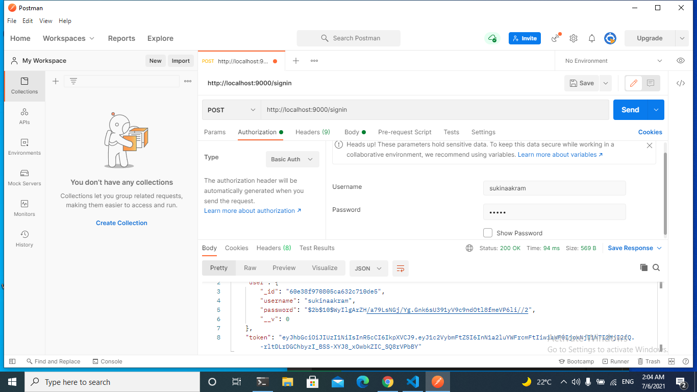
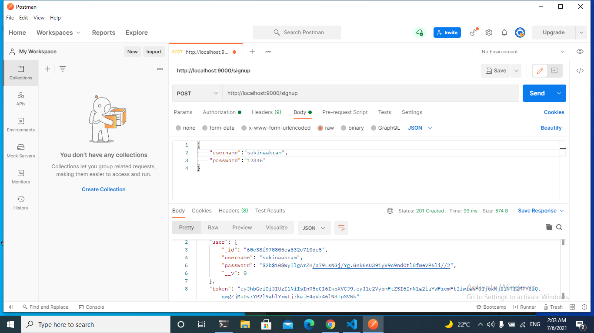
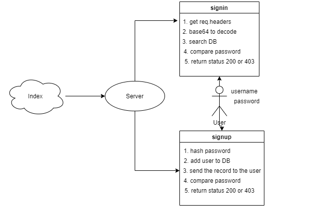

# bearer-auth

### Auther : Sukina Abu-Hmmad

### install :
1. copy the link of the repo
2. clone the repo on your local machine 3.   by git clone repo-url
4. download independencies by npm i
5. create a .env, then cope the content 6. of .env.sample file inside the .env 7. file.
8. fill the variables of .env
9. run the app

[test Report](https://github.com/Sukina12/bearer-auth/actions)

[deployment]()

[pull request](https://github.com/Sukina12/bearer-auth/pull/1)

### Setup :
PORT - port number
MONGODB_URL - port number
SECRET - a random string

### Test
 * Unit test: npm run test
* Lint test: npm run lint

### UML :
